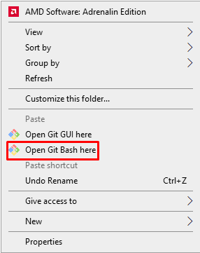
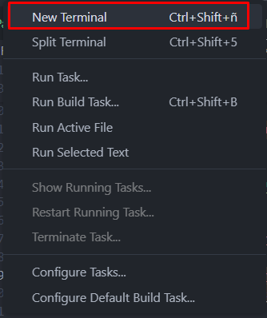

# Como preparar el entorno

## 1. Clonar el repositorio

### 1.1 Crear una carpeta donde quieras que se guarde el proyecto

### 1.2 Dentro de la carpeta dar click derecho y abrir git bash aquí



### 1.3 Ingresar el siguiente comando en el git bash para clonar el repo

```sh
git clone https://github.com/samuop/Analisis_Numerico.git
```

### 1.4 Abrir una nueva terminal desde la carpeta del proyecto en el vscode



### 1.5 Crear el entorno virtual ingresando el siguiente comando en la terminal

```sh
python -m venv env
```

### 1.6 Activar el entorno virtual ingresando el siguiente comando

```sh
.\env\Scripts\activate
```

### 1.7 instalar las dependencias con el siguiente comando

```sh
pip install -r requirements.txt
```

>[!NOTE]
>Este paso puede tardar un poco, tener paciencia...

### 1.8 Instalar las siguientes extensiones en vscode

* Jupyter
* Python

### Comando para desactivar el entorno virtual cuando termines de trabajar

```sh
deactivate
```

> [!WARNING]  
> No hacer push directamente sobre main si no podes pisar el trabajo de otro compañero.
> Cada uno deberia crear una nueva rama para trabajar para posteriormente unificarlas
